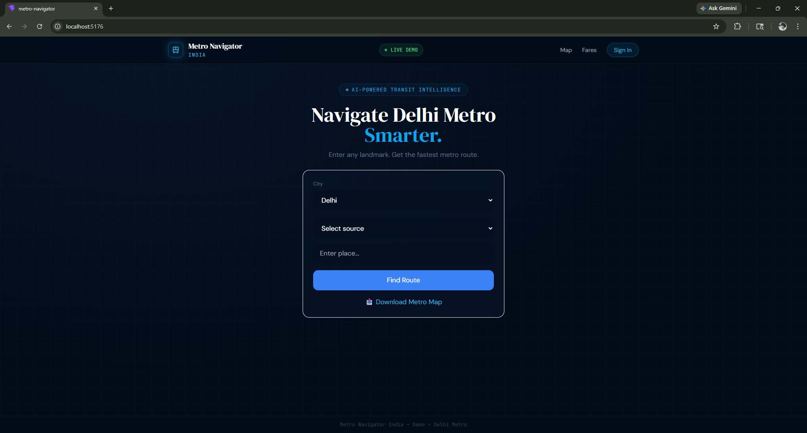
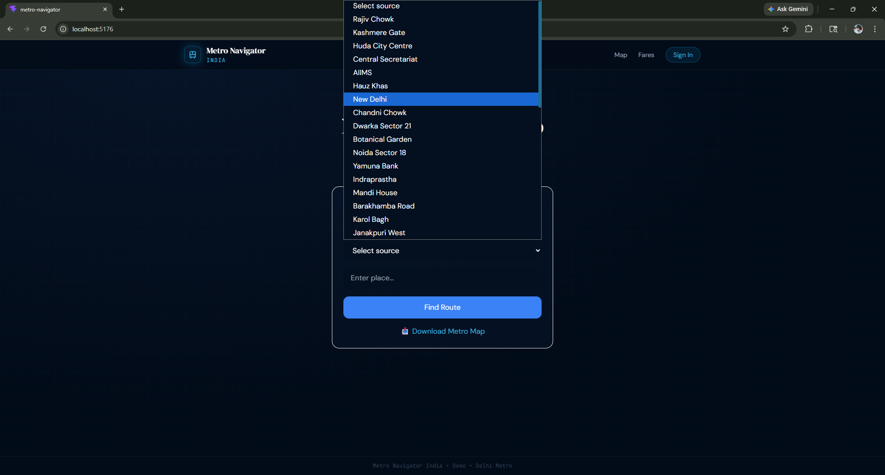
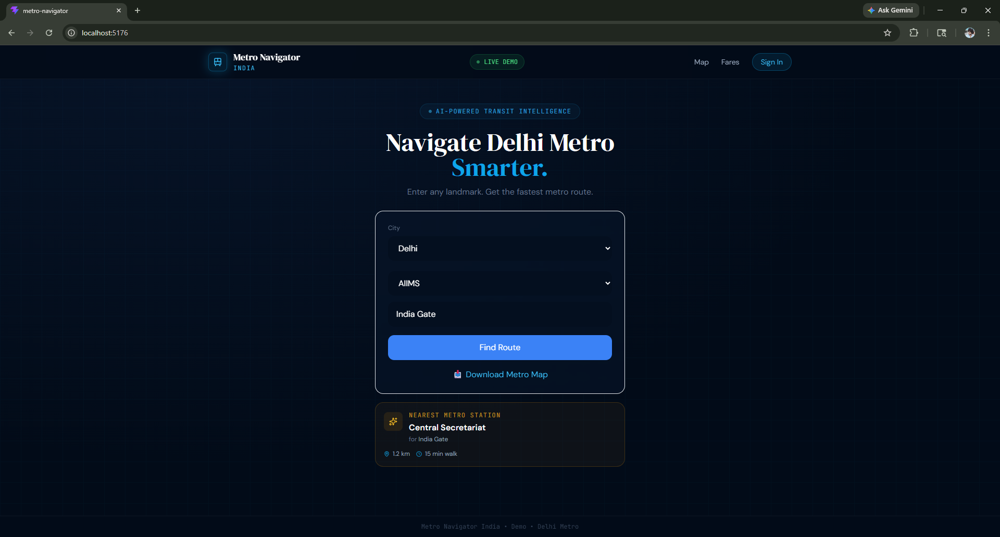
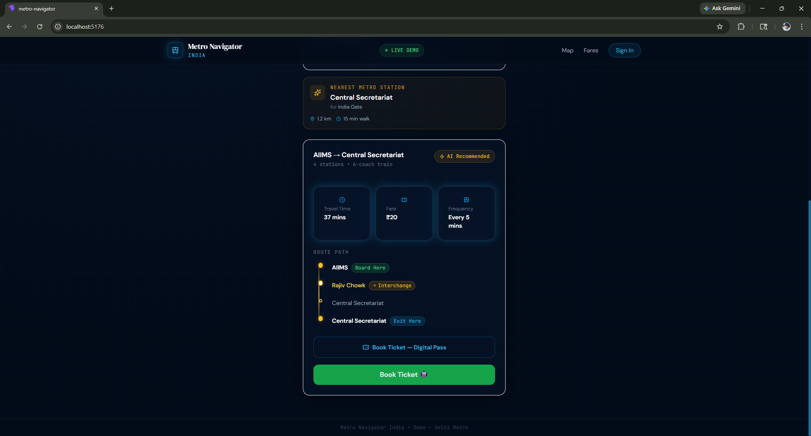

# 🚇 Metro Navigator India

> Navigate Smarter. Travel Faster. Think in Landmarks — Not Stations.

An AI-powered metro navigation system that allows users to search routes using real-world places (e.g., *India Gate*) instead of requiring metro station knowledge.

---

## 🌟 Key Features

### 🔍 Smart Destination Input
- Accepts real-world landmarks (India Gate, Red Fort, etc.)
- Automatically maps to nearest metro station

### 🚉 Intelligent Route Planning
- Source → Destination navigation
- Displays:
  - Route path (stations)
  - Interchanges
  - Travel time
  - Fare estimate
  - Train frequency

### ⭐ Favorites & Recent Routes
- Save frequently used routes
- One-click reuse for daily travel ( University , Office , Home ..)

### 📥 Offline Metro Map
- Download Delhi Metro map for offline use

### 🎯 Clean UI/UX
- Cinematic design
- Smooth animations
- Responsive layout

---

## 🧠 Core Innovation

> Users think in **places**, not **station names**.

Metro Navigator bridges this gap using a **Landmark Intelligence Layer** that converts human input into optimized metro routes.

---

## 🛠 Tech Stack

### Frontend
- React (Vite)
- Tailwind CSS
- Framer Motion
- Lucide Icons

### Data Layer
- Custom Metro Graph
- Landmark → Station Mapping

### Future Backend (Planned) - On GOing
- Java + Spring Boot
- REST APIs
- Dijkstra Algorithm Engine

---

## 🚀 How It Works

1. User enters destination (e.g., *India Gate*)
2. System finds nearest metro station (*Central Secretariat*)
3. Route engine calculates best path
4. UI displays full journey details

---

## 📸 Demo Preview

### 🏠 Home Interface

### 🔍 Smart Search (Landmark Input)

### 🚉 Route Result

### ⭐ Favorites & Offline Map

---

## 🧪 Example Usage
Source: Rajiv Chowk
Destination: India Gate

Output:
Nearest Station: Central Secretariat
Route: Rajiv Chowk → Central Secretariat
Time: 25 mins
Fare: ₹40
frequency : 5 Mins

## 🌍 Future Scope 
Live train tracking 🚆
AI crowd prediction 🤖
Ticket booking system 🎫
Multi-city support 🇮🇳
Voice navigation 🎙️